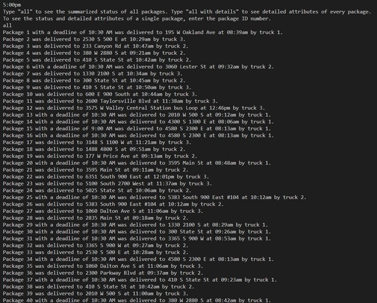
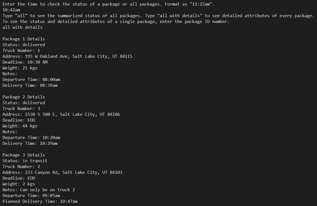
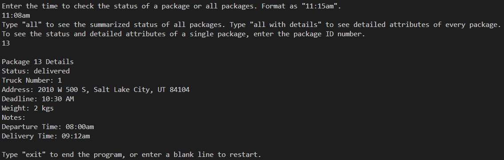
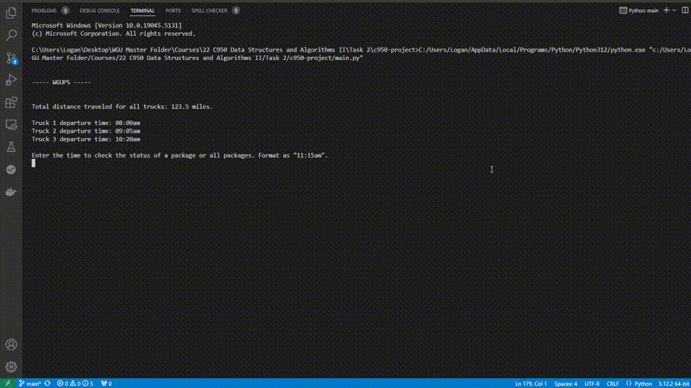

# Package Delivery Simulation

## Table of Contents
- [About the Project](#about-the-project)
- [Algorithm](#algorithm)
- [Key Features](#key-features)
- [Usage](#usage)
- [License](#license)
- [Contact](#contact)

<!-- ABOUT THE PROJECT -->
## About The Project
This project simulates a fleet of trucks that deliver packages to various addresses. It efficiently manages the distribution of packages across multiple trucks, calculating optimal delivery routes using the nearest-neighbor algorithm and providing time-based tracking updates for each package. The project implements the following functionalities:

- Load packages and assign them to trucks.
- Use the nearest-neighbor algorithm to route each truck for deliveries.
- Update package status based on the time of delivery.
- Allow users to query package status by entering a specific time.

The system supports multiple trucks and packages, calculating delivery times and distance traveled. The user can query the system to check the status of a package or all packages at any given time.

<!-- ALGORITHM -->
## Algorithm
The system uses the Nearest Neighbor Algorithm to determine the optimal route for each truck. This approach ensures that:

1. The truck starts at the hub.
1. The truck picks the closest package to its current location.
1. The truck continues picking the closest remaining package until all deliveries are made.
1. After completing deliveries, the truck returns to the hub.

<!-- KEY FEATURES -->
## Key Features:
- **Greedy Nearest-Neighbor Algorithm**: The core algorithm routes trucks by selecting the closest unvisited package, ensuring efficient delivery paths.
- **Time-based Package Status Updates**: Users can query the status of a specific package at a given time (e.g., in transit, delivered, or delayed).
- **Time Complexity**: The main delivery algorithm runs in O(n^2), where n is the number of packages on each truck, due to finding the closest neighbor for each package.
- **Scalability**: The system is designed to easily accommodate additional trucks and packages.

<!-- USAGE -->
## Usage
After running the program, the system will print out details about truck departure times and total mileage traveled. Users can query package status by entering specific times, view the status of all packages, or check a particular package by ID using the following inputs:

- **"hh:mm am/pm"**: Enter a time to query the status of a package.
- **"all"**: View the summarized status of all packages.
- **"all with details"**: View detailed attributes of every package.
- **Package ID**: Query a single package by entering its ID.

The program will provide time-based feedback based on the time you query, allowing you to track packages and trucks effectively. Additionally, you can modify the CSV files to add new packages or change truck routes, making the system adaptable for different scenarios.

**Demo screenshot of using "all":**

**Demo screenshot of using "all with details":**

**Demo screenshot of querying for a single package ID:**

**Demonstration of user interface:**

<!-- CODE STRUCTURE -->
# Code Structure
The project is divided into several modules, each handling different aspects of the system:

### `main.py`
*   The entry point for the simulation.
*   Loads and processes package data.
*   Manages truck assignments and deliveries.
*   Allows user interaction for querying package status.

### `truck.py`
*   Contains the `Truck` class and the `TruckStatus` enumeration.
*   Handles truck attributes such as ID, status, mileage, departure time, and package list.
*   Includes a method for adding packages to a truck and managing truck status.

### `package.py`
*   Contains the `Package` class and the `PackageStatus` enumeration.
*   Manages package attributes such as ID, address, weight, status, and delivery times.
*   Includes methods for printing package information and updating statuses based on the time entered by the user.

### `hash_table.py`
*   Implements a basic hash table using chaining for collision handling.
*   Allows for adding and retrieving packages based on their unique IDs.

### `data/`
*   **Packages.csv**: Contains the data for each package, including its ID, address, city, state, zip code, deadline, weight, and any notes.
*   **Addresses.csv**: Contains a list of all possible addresses.
*   **Distances.csv**: Contains the distance matrix for each address.

<!-- License -->
## License:
This project is licensed under the MIT License - see the [LICENSE](LICENSE) file for details.

<!-- CONTACT -->
## Contact
Logan Drda - logan.drda.cs@gmail.com